# Original post: images and notes

Source: [Machine Learning Model to Predict Heart Disease](https://rhoguns.hashnode.dev/machine-learning-model-to-predict-heart-disease), March 23, 2023. These notes summarize the article and describe its screenshots. All figures below are from the **original 2023 run**, not from the new `train.py`. The [image source manifest](images/sources.json) records each original URL.

## 1. Notebook setup

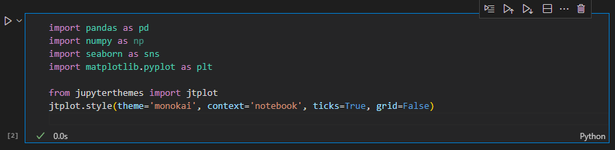

The original notebook imported pandas, NumPy, Seaborn and Matplotlib and set a Jupyter plotting theme. The article also lists AutoGluon and scikit-learn among its tools.

## 2. Data loaded from CSV

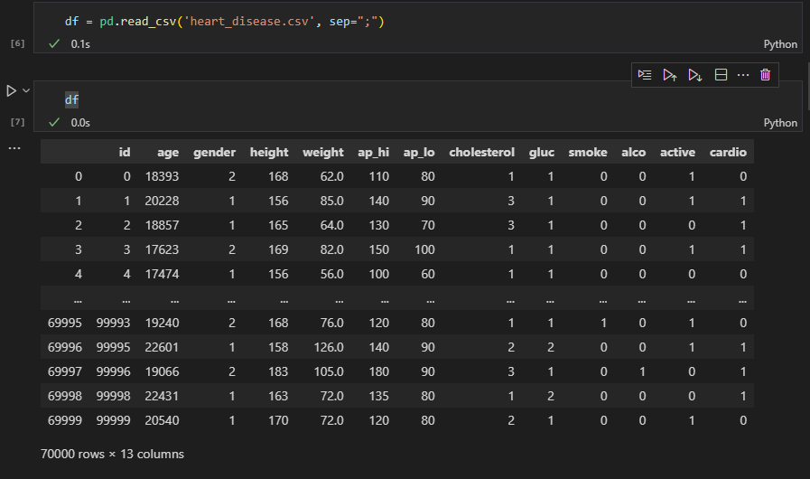

The notebook read `heart_disease.csv` with `sep=";"`. The displayed data had **70,000 rows and 13 columns**, including `id`, 11 predictors and the `cardio` target. The linked source dataset is the [Kaggle Cardiovascular Disease Dataset](https://www.kaggle.com/datasets/sulianova/cardiovascular-disease-dataset). The CSV itself was not published in the post.

## 3. Age conversion

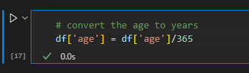

The screenshot converts age from days to years by dividing by **365**. The article also says the `id` column was removed before modeling, leaving 12 columns.

## 4. Data summary

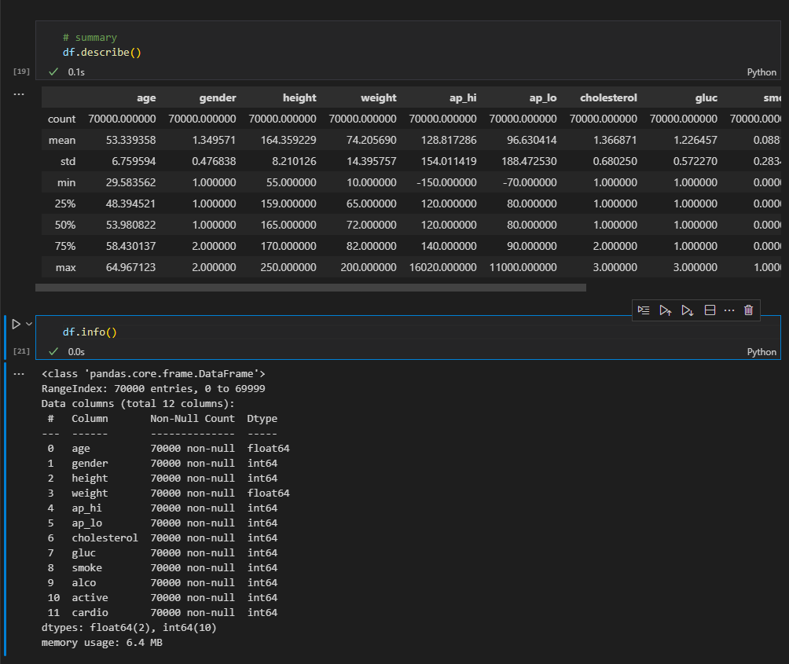

The notebook inspected summary statistics and `DataFrame.info()`. The displayed columns had 70,000 non-null values. This check documents completeness of the original CSV; it does not establish that all values were clinically plausible.

## 5. Feature histograms

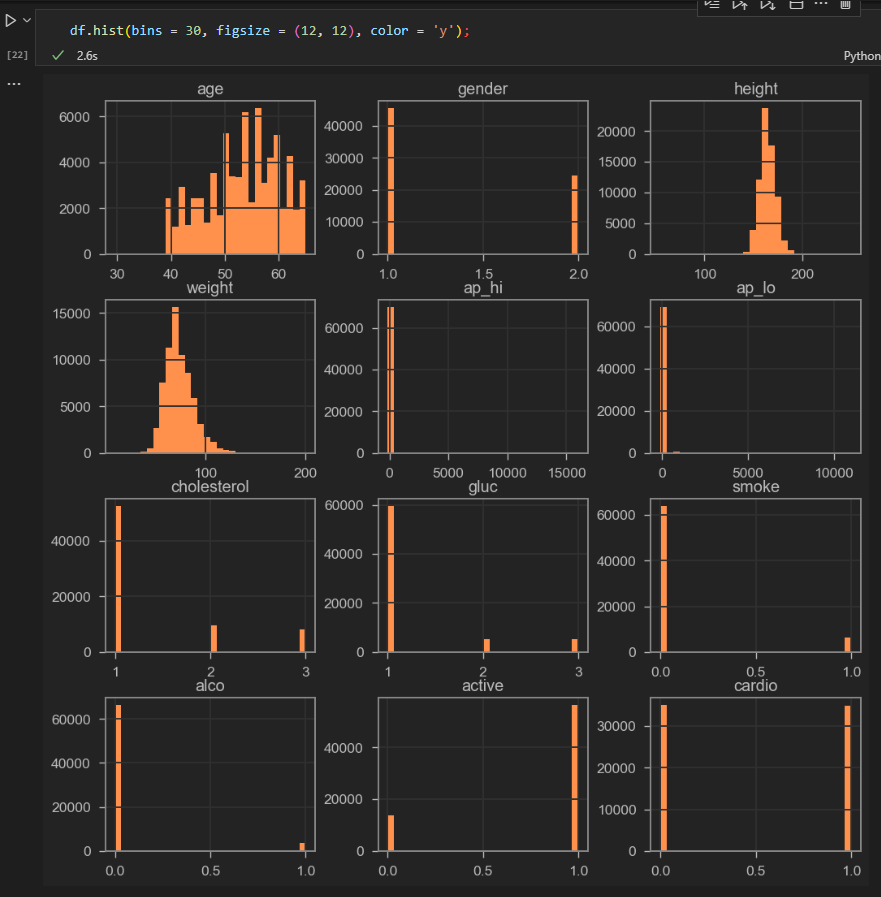

The author plotted histograms across the tabular fields. The article notes that smoking and alcohol use were uncommon in this dataset. The visualizations were exploratory and did not form part of the fitted model output.

## 6. Correlation heatmap

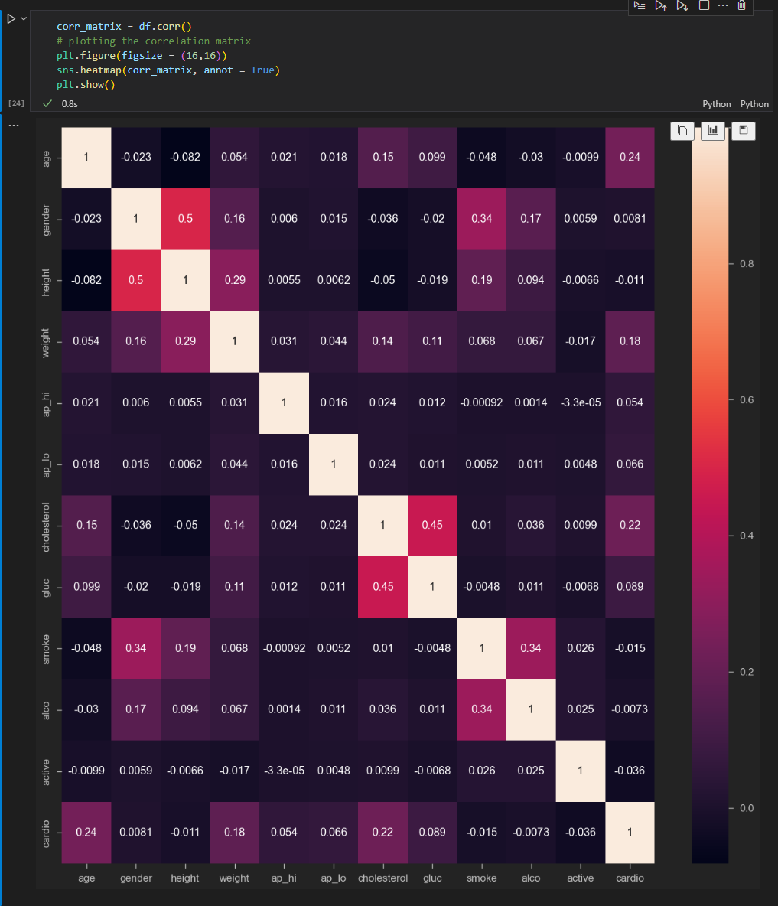

The heatmap shows pairwise correlations, including visible relationships between height and gender and between glucose and cholesterol. A diagonal value of 1 means each field is perfectly correlated with itself.

## 7. Train and test split

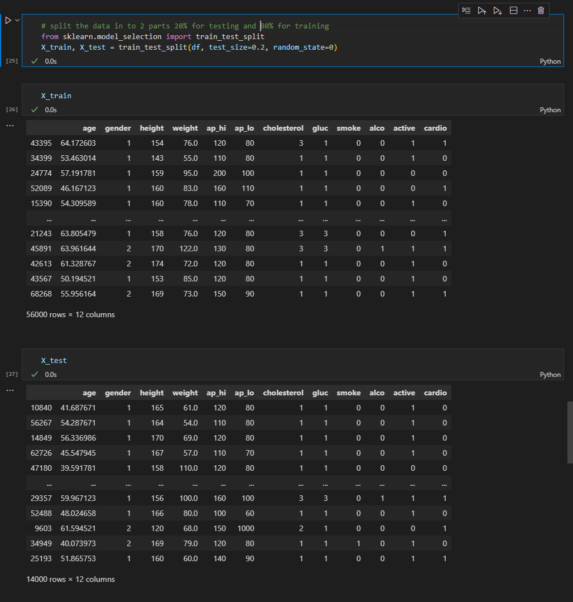

The notebook called `train_test_split(df, test_size=0.2, random_state=0)`, producing **56,000 training rows** and **14,000 test rows**. `cardio` remained in both frames so AutoGluon could use it as the training label. The reconstructed script uses the same split settings.

## 8. AutoGluon fit

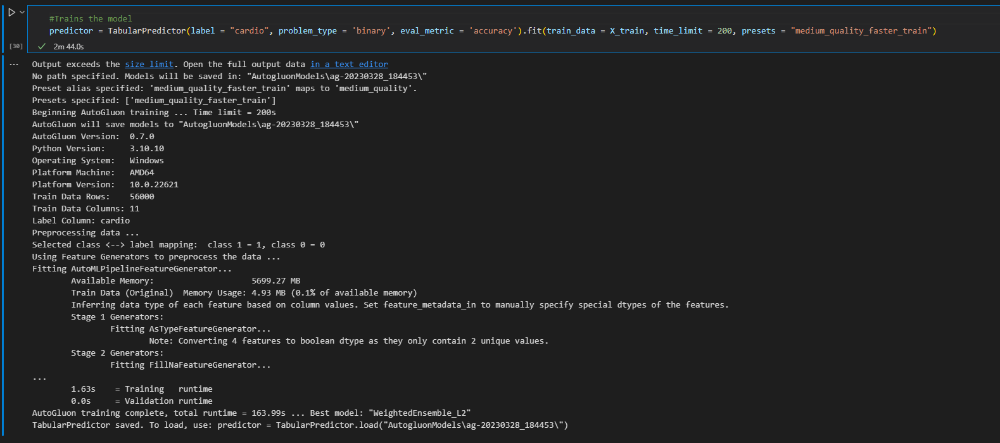

The screenshot fits a binary `TabularPredictor` for `cardio` with accuracy as the evaluation metric, a **200-second** limit, and the then-used `medium_quality_faster_train` preset. The output names `WeightedEnsemble_L2` as the best model. Recent AutoGluon versions call the equivalent preset `medium_quality`, which is the reconstructed script's default.

## 9. Model summary

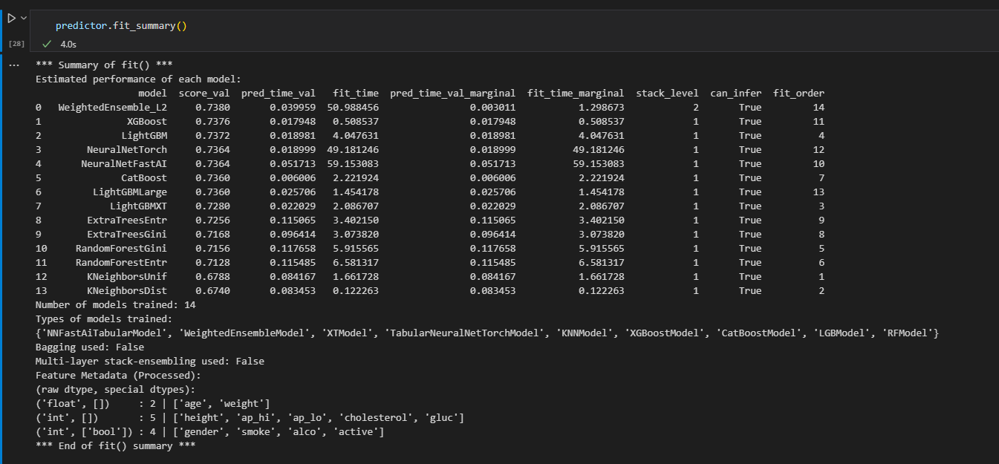

The original run trained **14 models**. In the displayed validation summary, `WeightedEnsemble_L2` scored **0.7380**. This is a validation result from the 2023 run, not a measured result of this reconstruction.

## 10. Leaderboard

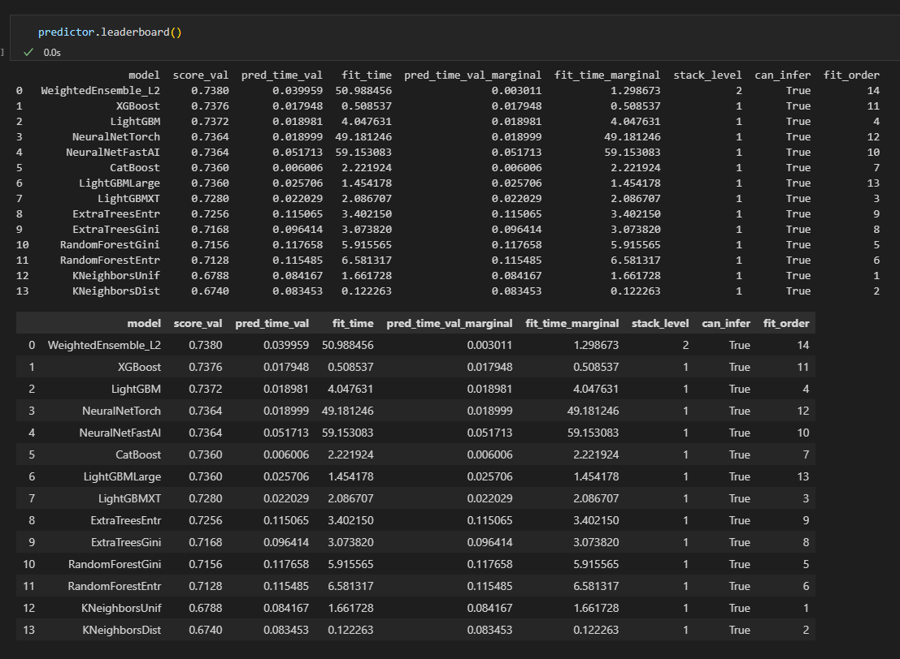

The leaderboard compares model scores, prediction times and fit times. The ensemble is listed first, followed by models including XGBoost and LightGBM. Results can change with package versions and machine resources.

## 11. Test predictions

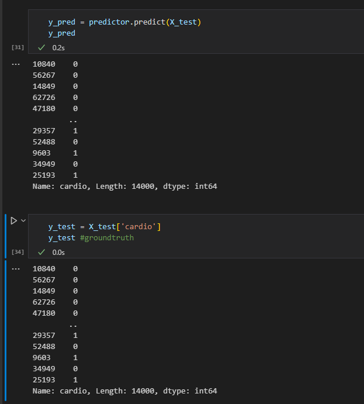

The original notebook predicted labels for the 14,000-row test frame, then selected `cardio` as ground truth. The screenshot shows the first and last few predictions and labels.

## 12. Confusion matrix

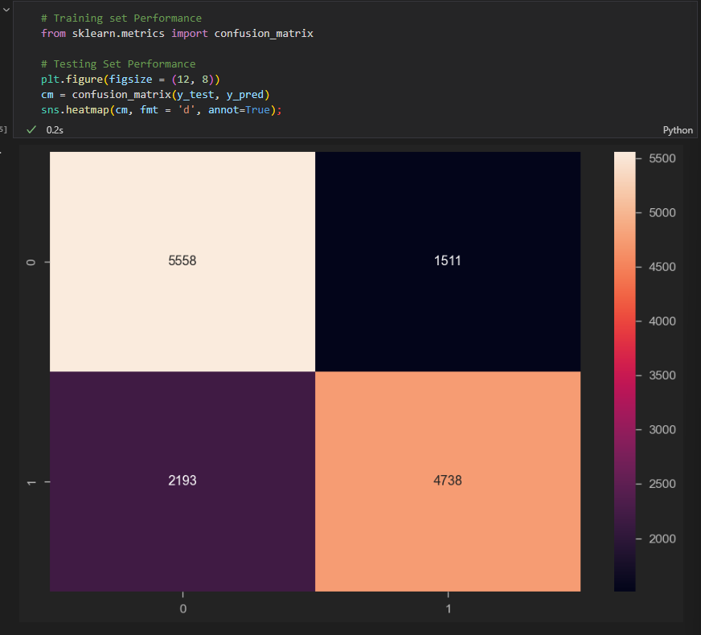

The displayed matrix contains **5,558 true negatives**, **1,511 false positives**, **2,193 false negatives**, and **4,738 true positives**. These sum to 14,000 test rows. Its layout uses actual class on rows and predicted class on columns.

## 13. Classification report

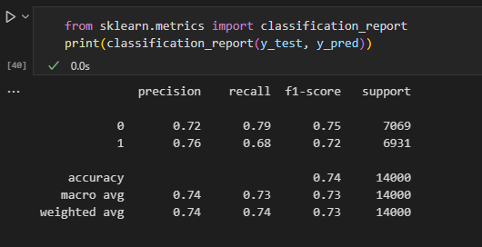

The report shows **0.74 overall accuracy** on 14,000 test rows. For class 0, precision/recall/F1 were **0.72 / 0.79 / 0.75**; for class 1 they were **0.76 / 0.68 / 0.72**. No clinical validation was reported in the article.
